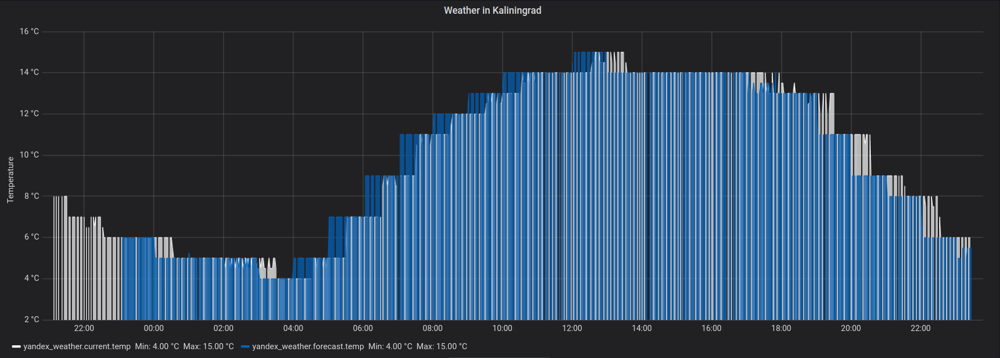

# Задание по мониторингу из курса DevOps

Было решено использовать раздел с прогнозом погоды от Яндекса для получения текущей температуры воздуха и почасового прогноза. С помощью Graphite метрики отправлялись в Grafana, получилась следующая визуализация:

Белым цветом на графике отображена текущая погода, синим – прогноз. Видно, что в целом данные текущей температуры и прогнозные данные отличались не сильно, также отображаются минимальные и максимальные значения для соответствующих метрик.
